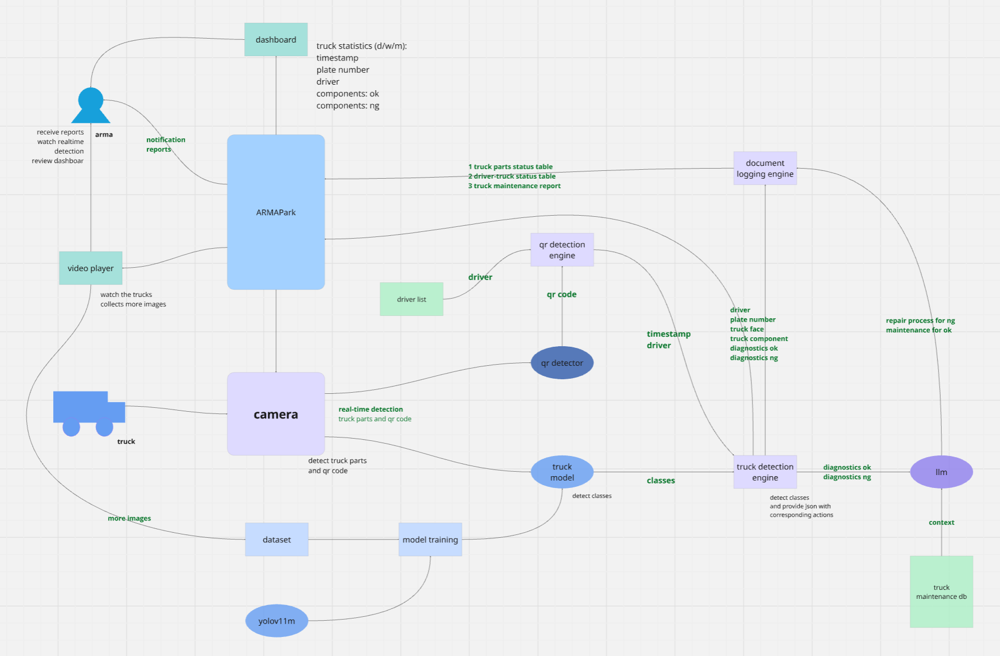

# truck_diagnostics_arma
use yolov11 object tracking to detect truck parts and diagnose its status

install ffmpeg
https://www.gyan.dev/ffmpeg/builds/
system variable path
or
winget install "FFmpeg (Essentials Build)"